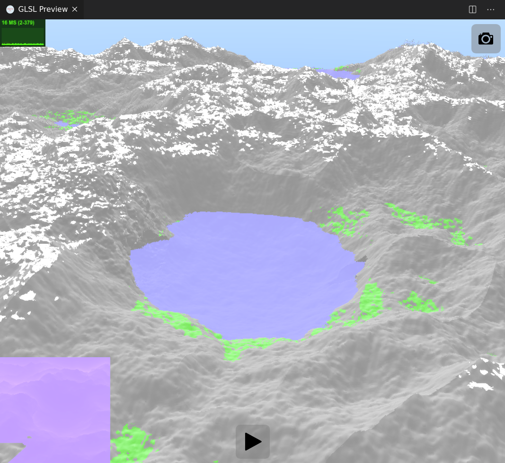

# Rapport du TP 1 de MMV
Notre groupe est composé de Jean-Baptiste Loutfalla et Mathéo Dumont.
  
Le shader : <https://www.shadertoy.com/view/ws3Bz2>



# Notre shader

## Formes

La fonction modelant le terrain est `Implicit(in vec3 p)` *ligne 166*. 
### I. Terrain
Ligne 27.
Nous composons notre terrain avec du rigde noise et du noise.

### II. Disque
Disque Ligne 63.
Nous utilisons un disque comme vu en cours mélangé(Ligne 83) avec la formule du cours :
```glsl
vec2 blend(in vec2 a, in vec2 b)
{
    float new_alpha = (a.y + b.y);
    float new_height = (a.x*a.y + b.x*b.y) / new_alpha;
    return vec2(new_height, new_alpha);
}
```
pour obtenir une vallée et y placer un lac.

### III. Tunnel
Segment Ligne 139.
Différence Ligne 110. 
En utilisant des SDB, nous calculons la distance à un segment et faisons une différence avec le terrain,
pour créer un tunnel qui relie le lac en premier plan à un autre.

### IV. Avancement et Zone supprimée dans la montagne
BlendImplicit Ligne 122. 
Sphere Ligne 128.
Nous utilisons un segment et une sphère mélangés entre eux pour obtenir un avancement de falaise dans 
lequel nous creusons avec l'opérateur `Diff`.

### V. Eau
Eau Ligne 58.
Nous avons séparé le calcul de l'eau de celui du terrain en utilisant 2 fonctions d'intersection, 
une pour le terrain et une autre pour l'eau, pour pouvoir définir les couleurs différement dans la 
fonction `Render( in vec3 ro, in vec3 rd, bool pip )` ligne 295.

### VI. Autres
Pour les autres formes et opérateurs implémentés mais pas forcement testés, il y a :
* Opérateur Replace : Ligne 88
* Opérateur implicite Union : Ligne 100
* Opérateur implicite Inter : Ligne 105

  
## Textures
Ca se passe ici `Render( in vec3 ro, in vec3 rd, bool pip )` ligne 295.

* Soit une couleur pour le ciel : ligne  312
* Si on a de l'eau alors, la couleur qui va avec. 
* Ligne 329-342 : Si la pente est inferieur à un certain degré, que la hauteur est suffisante et l'orientation correcte, on affiche la neige
* sinon, de l'herbe si la hauteur et la pente le permettent.

Pour l'orientation, la hauteur et la pente, on ajoute du bruit pour eviter d'avoir des effets de démarquation trop nets.
